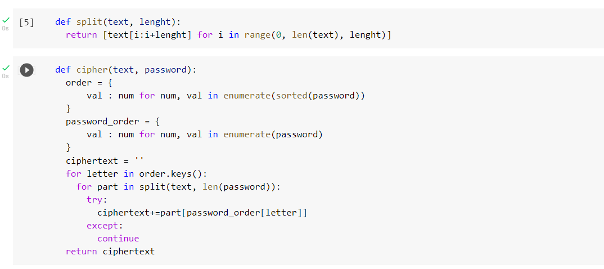
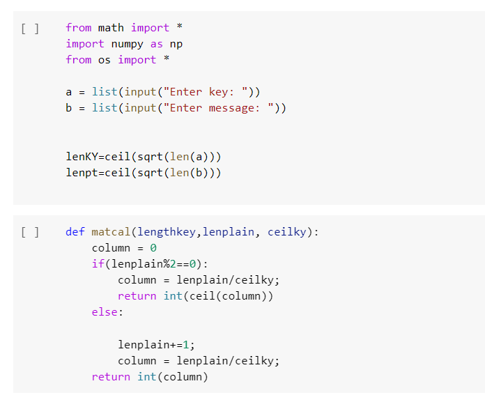
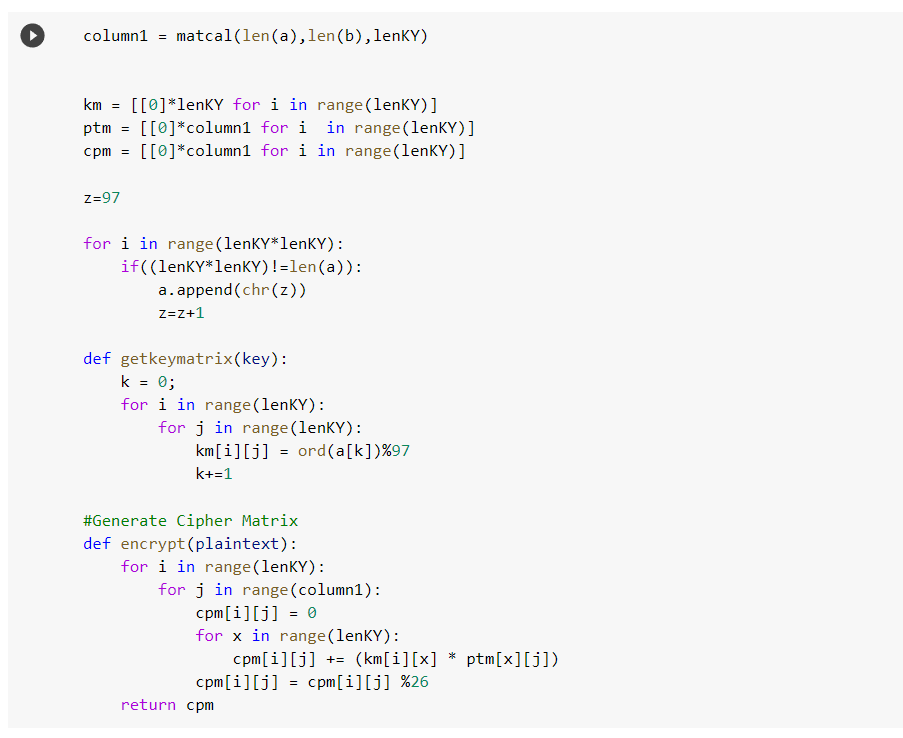
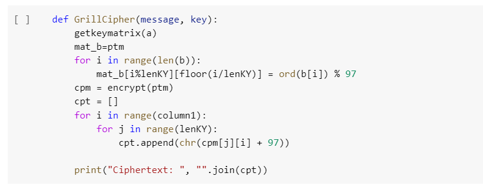
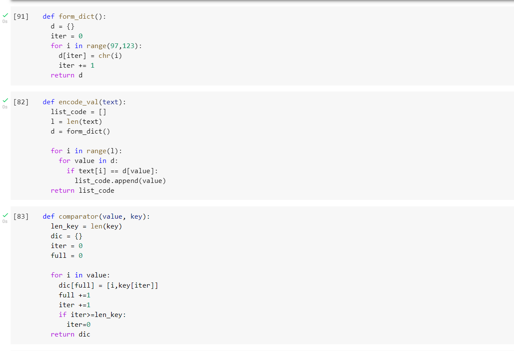
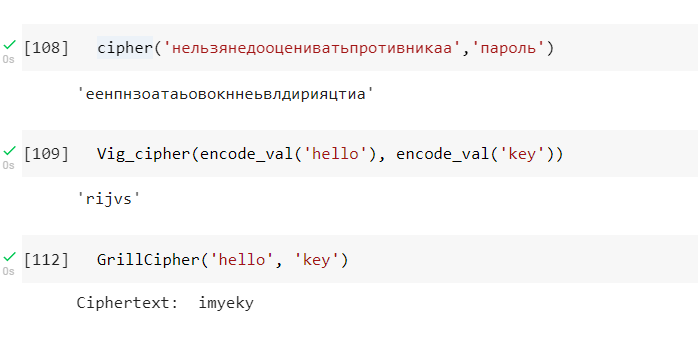

---
## Front matter
lang: ru-RU
title: Лабораторная работа №2
author: |
	Сапёров Максим Александрович - студент группы НПМмд-02-22
date: 08.01.2022

## Formatting
toc: false
slide_level: 2
theme: metropolis
header-includes:
 - \metroset{progressbar=frametitle,sectionpage=progressbar,numbering=fraction}
 - '\makeatletter'
 - '\beamer@ignorenonframefalse'
 - '\makeatother'
aspectratio: 43
section-titles: true
---

# Шифры перестановки

## Прагматика выполнения

Умение пользоваться методами маршрутного, решеточного, Виженера шифрований

## Цель выполнения лабораторной работы

Освоить на практике использование методов маршрутного, решеточного, Виженера шифрований

## Задачи выполнения работы

Написать функции, которые реализуют шифрование маршрутного, решеточного, Виженера.

## Результаты выполнения лабораторной работы. Написал код для зашивровки кодов Маршрутным шифрованием

{ #fig:001 width=70% }

## Написал код для зашивровки кодов с помощью решеточного шифрования

{ #fig:003 width=70% }

## Часть 2

{ #fig:004 width=70% }

## Часть 3

{ #fig:005 width=70% }

## Написал код для зашивровки кодов с помощью таблицы Виженера

{ #fig:007 width=70% }

## Результаты тестов.

{ #fig:012 width=70% }  

## Выводы

Освоил на практике применение методов маршрутного, решеточного, Виженера шифрований 
