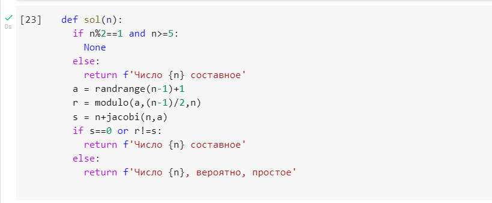
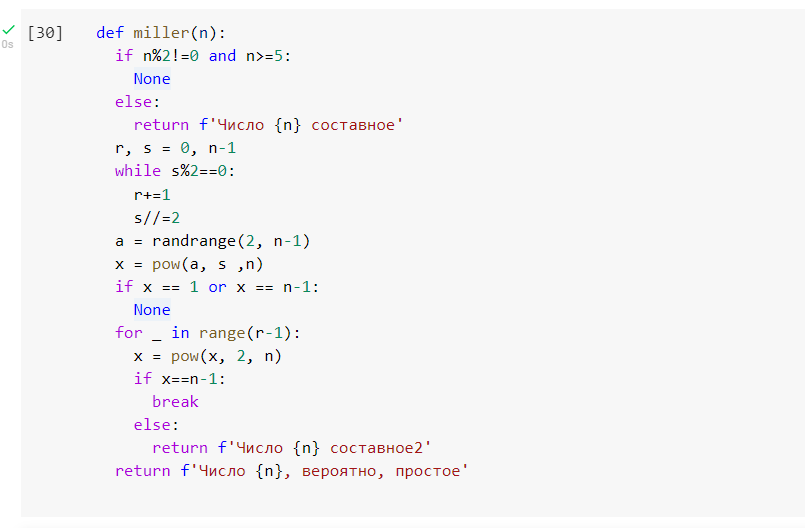
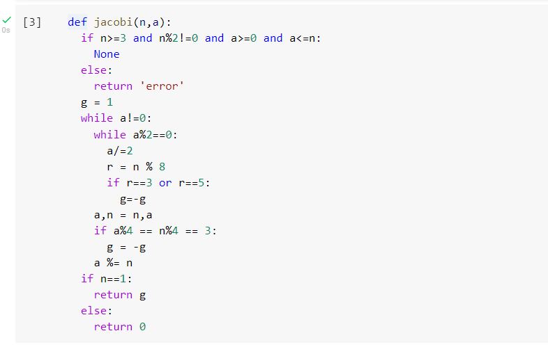
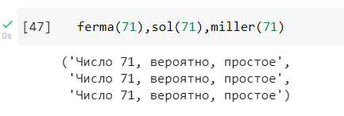

---
## Front matter
lang: ru-RU
title: Лабораторная работа №5
author: |
	Сапёров Максим Александрович - студент группы НПМмд-02-22
date: 08.01.2022

## Formatting
toc: false
slide_level: 2
theme: metropolis
header-includes:
 - \metroset{progressbar=frametitle,sectionpage=progressbar,numbering=fraction}
 - '\makeatletter'
 - '\beamer@ignorenonframefalse'
 - '\makeatother'
aspectratio: 43
section-titles: true
---

# Вероятностные алгоритмы проверки чисел на простоту

## Прагматика выполнения

Умение использовать и программировать вероятностные алгоритмы проверки чисел на простоту

## Цель выполнения лабораторной работы

Освоить на практике вычисление проверки числа на простоту с помощью вероятности

## Задачи выполнения работы

1. Реализовать алгоритм теста Ферма
2. Реализовать вычисления символа Якоби
3. Реализовать алгоритм  теста Соловэя-Штрассена
4. Реализовать алгоритм теста Миллера-Рабина

## Результаты выполнения лабораторной работы.
Написал код для вычисления теста Ферма. Все функции реализованы шаблонами:

{ #fig:001 width=70% }

## Написал код для вычисления теста Соловэя-Штрассена.

{ #fig:002 width=70% }

## Реализовал вычисление теста Миллера-Рабина

{ #fig:003 width=70% }

## Реализовал вспомогательную функцию вычисления случайного числа

{ #fig:004 width=70% }

## Результаты тестов.

{ #fig:005 width=70% }

## Выводы

Освоил на практике вычисление наибольшего делителя разными способами
